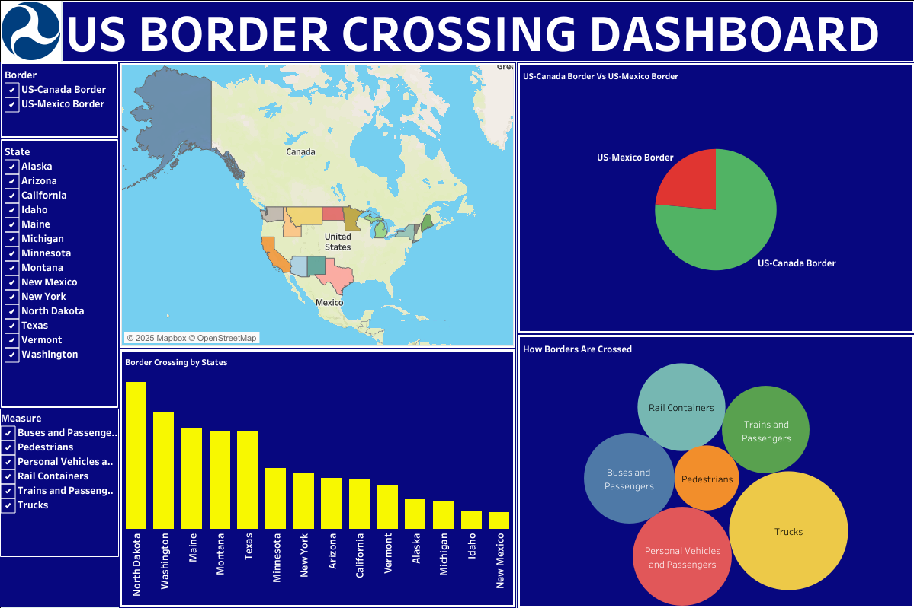

# US BORDER CROSSING ANALYSIS

## BUSINESS TASK STATEMENT
**To Evalauste the inbound crossings at the U.S.-Canada and the U.S.-Mexico Border at the Port Level.** 

## EXECUTIVE SUMMARY
The Bureau of Transportation Statistics (BTS) Border Crossing Data provides summary statistics for inbound crossings at the U.S.-Canada and the U.S.-Mexico border at the port level. 
Data are available for trucks, trains, containers, buses, personal vehicles, passengers, and pedestrians. 
Border crossing data are collected at ports of entry by U.S. Customs and Border Protection (CBP). 
The data reflect the number of vehicles, containers, passengers, or pedestrians entering the United States.

### MAJOR POINT FOR ANALYSIS
1.  To examine both US-Canada and US-Mexico
2.  Determine which borders have major crossings and possible reasons
3.  Check the media to which people cross borders 

### DATA SOURCE
**[US Border Crossing Dataset Link](https://catalog.data.gov/dataset/border-crossing-entry-data-683ae)**

## ANALYSIS PROCEDURE

### DATA PREPARATION, CLEANING AND EXPLORATORY DATA ANALYSIS (EDA) USING EXCEL AND POWER QUERY
1. First, we had these columns (Port Name, State, Port Code, Border, Date, Measure, Value, Latitude, Longitude, Point) before analysis on Excel.
2. I checked for null or blank rows. I had non
3. I checked and removed duplicate values
4. Uploading the datasets on Power Query.
5. I removed the columns to only those relevant for the analysis (Port Name, State,	Border, Date, Measure, Latitude, Longitude).
6. The measure column has related fields, so I combined related ones to form one field to make the analysis easy to understand and to avoid confusion
7. The columns were formatted to the suitable data types.
8. The cleaned dataset was uploaded to Tableau for proper analysis.

**[CLEANED DATASET FOR ANALYSIS](US-Border-Crossing-Cleaned-Dataset.xlsx)**

### VISUALIZATION ON TABLEAU

**[Tabeau Visualization Link](https://public.tableau.com/views/USBORDERCROSSINGDASHBOARD/Dashboard1?:language=en-US&:sid=&:redirect=auth&:display_count=n&:origin=viz_share_link)**

## MAJOR FINDINGS
1. There were more ports within the US-Canada border compared to the US-Mexico border, indicating more movement and activities within the US-Canada border.
2. Generally, truck border movement was found to be the highest in both the US-Canada and the US-Mexico border, indicating that surge of economic activities between the US and Canada and the US and Mexico.
3. People mainly cross the border using a personal vehicle, buses, and trains, possibly for vacations, recreation, relocation, education, or work. Pedestrians were also seen across all the port borders.
4. On the US-Canada border, North Dakota had the highest border activities compared to Idaho, which had the lowest activities. However, for the US-Mexico border, Texas has the highest activities compared to New Mexico, which has the lowest.

## MY RECOMMENDATIONS

These are my recommendations:
1.  Abolish the Pedestrian crossings at the border, as they can be dangerous.
2.  Subsidize transport costs to help everyone utilize the means of transportation provided
3.  More business activities, investment, and development should happen mostly in the US-Canada to increase revenue. The US-Mexico border should also be paid attention to

